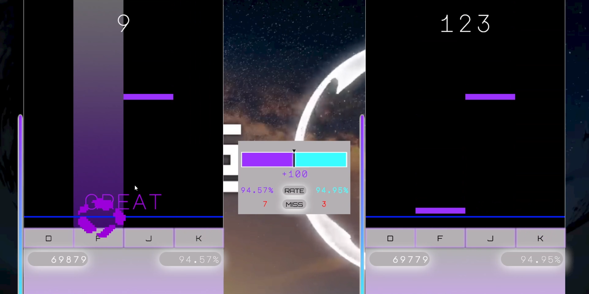

## 프로젝트 개요

### 프로젝트 명: InMusic

### 장르: 4키 건반형 리듬게임
본 게임은 4키 건반형 리듬게임으로, 싱글플레이와 멀티플레이가 가능합니다. 
플레이 및 기능 설명의 경우 Youtube 영상에서 확인하실 수 있습니다. 
해당 프로젝트는 창업 동아리 Insight 내 게임 개발 인원과 학습 목적으로 진행된 프로젝트입니다. 
학습 목적에 따라 3단계로 나누어, 싱글 플레이, 외부 API 및 데이터베이스 연동, 멀티 플레이로 구분하여 개발하였습니다. 

### 플레이 및 기능 설명 영상

### Youtube : https://youtu.be/aCe0TO44fF0

### 프로젝트 진행 기간

1. 싱글 플레이: 2024.10 ~ 2025.02
2. DB, Steam 연동: 2025.03 ~ 2025.05
3. 멀티 플레이: 2025.07 ~ 2025.09
 

### 개발 인원 및 역할

신승우
- 싱글플레이 기반 아웃게임 기능 개발
- XAMPP기반 DB 연동 개발
- Steamworks API 기반 유저 정보 연동 개발
- 멀티플레이 Photon Fusion2 Shared Mode 기반 아웃게임 기능 개발
- 멀티플레이 테스트 환경 구성
- FMOD 설정 및 Audio System 설계 및 구현
- 게임 플레이 진행 매니저 시스템 구현

 

유민형
- 싱글플레이 기반 인게임 기능 개발
- BMS 파일 제작
- 멀티플레이 Photon Fusion2 Shared Mode 기반 인게임 기능 개발
- 멀티플레이 개발 환경 구성
- FMOD 설정 및 Audio System 설계 및 구현
- 게임 플레이 진행 매니저 시스템 구현

 

### 프로젝트 구성 (샘플 코드 첨부)

📦InMusic_Scripts_Sample
 ┣ 📂DB
 ┃ ┣ 📜DBService.cs
 ┃ ┗ 📜SongTitleList.cs
 ┣ 📂LoadingSong
 ┃ ┗ 📜LoadingSong.cs
 ┣ 📂Managers
 ┃ ┣ 📜GlobalInputManager.cs
 ┃ ┣ 📜LoadManager.cs
 ┃ ┣ 📜SingleMenuInputManager.cs
 ┃ ┣ 📜Singleton.cs
 ┃ ┗ 📜UIInputManager.cs
 ┣ 📂Multi
 ┃ ┣ 📂GamePlay
 ┃ ┃ ┣ 📜ClientSongListBlock.cs
 ┃ ┃ ┣ 📜GameStartManager.cs
 ┃ ┃ ┣ 📜MultiHighLightSong.cs
 ┃ ┃ ┣ 📜MultiLoadingSong.cs
 ┃ ┃ ┣ 📜MultiSongListController.cs
 ┃ ┃ ┗ 📜SongSelectionNetwork.cs
 ┃ ┣ 📂Lobby
 ┃ ┃ ┣ 📜CreateMultiRoom.cs
 ┃ ┃ ┗ 📜LobbyUIController.cs
 ┃ ┣ 📂Network
 ┃ ┃ ┣ 📜NetworkManager.cs
 ┃ ┃ ┗ 📜SharedModeMasterClientTracker.cs
 ┃ ┣ 📂Player
 ┃ ┃ ┣ 📜PlayerInfoProvider.cs
 ┃ ┃ ┣ 📜PlayerPrefab.cs
 ┃ ┃ ┗ 📜PlayerStateController.cs
 ┃ ┣ 📂UI
 ┃ ┃ ┣ 📜PlayerContextMenu.cs
 ┃ ┃ ┣ 📜PlayerMenuManager.cs
 ┃ ┃ ┣ 📜PlayerSlotClickHandler.cs
 ┃ ┃ ┣ 📜PlayerSlotUI.cs
 ┃ ┃ ┗ 📜RoomNameUI.cs
 ┃ ┣ 📜MultiRoomManager.cs
 ┃ ┣ 📜PlayerUIController.cs
 ┃ ┗ 📜ReadyStartController.cs
 ┣ 📂PHP
 ┃ ┣ 📜handleGetAllSongs.php
 ┃ ┣ 📜handleGetMusicLog.php
 ┃ ┣ 📜handleSaveMusicLog.php
 ┃ ┣ 📜handleSteamLogin.php
 ┃ ┗ 📜updateMusicList.php
 ┣ 📂SavePlayData
 ┃ ┗ 📜SavePlayData.cs
 ┣ 📂SceneLoading
 ┃ ┗ 📜SceneLoading.cs
 ┣ 📂Single Menu
 ┃ ┣ 📜BackgroundController.cs
 ┃ ┣ 📜HighLightSong.cs
 ┃ ┣ 📜IndexSaveTest.cs
 ┃ ┣ 📜ScrollSlot.cs
 ┃ ┣ 📜SingleMenuController.cs
 ┃ ┗ 📜SongListController.cs
 ┗ 📂Steam
 ┃ ┣ 📜SteamAuthService.cs
 ┃ ┗ 📜SteamManager.cs

### 사용 음원
Cartoon, Jéja - On & On (feat. Daniel Levi)  
Janji - Heroes Tonight (feat. Johnning)  
Different Heaven & EH!DE - My Heart  
Warriyo - Mortals (feat. Laura Brehm)  
DEAF KEV - Invincible  
Elektronomia - Sky High  
Disfigure - Blank  
Cartoon, Jéja - Why We Lose (feat. Coleman Trapp)  
Electro-Light - Symbolism  
Spektrem - Shine  
 

### 프로젝트 리뷰
해당 프로젝트를 진행하면서, 2D 게임에서 게임 개발을 하기 위해 어떻게 환경 구성을 해야하는지, 그리고 기존에 컴퓨터공학과에서 배웠던 데이터베이스, 웹 서버 연동 등을 어떻게 게임에 접목이 가능한 지 알 수 있었습니다. UI에서는 Figma를 활용하여 구상하였던 부분인 확장성을 고려한 무한 재사용 스크롤뷰를 개발하면서 자료구조와 수학적인 부분을 코드로 옮기는 능력을 향상시킬 수 있었습니다. 또한 멀티플레이 게임을 처음 개발하는 입장에서 해당 게임을 제작한 경험이 큰 도움이 되었습니다. 멀티플레이에서는 Photon Fusion2를 활용하기 위해 기본적인 게임 서버 이론에 대해 공부할 수 있는 기회가 되었으며, 직접 여러 경우를 개발한 후 테스트를 진행하면서 Mode 별로 어떤 차이가 있는지 알 수 있었습니다.
